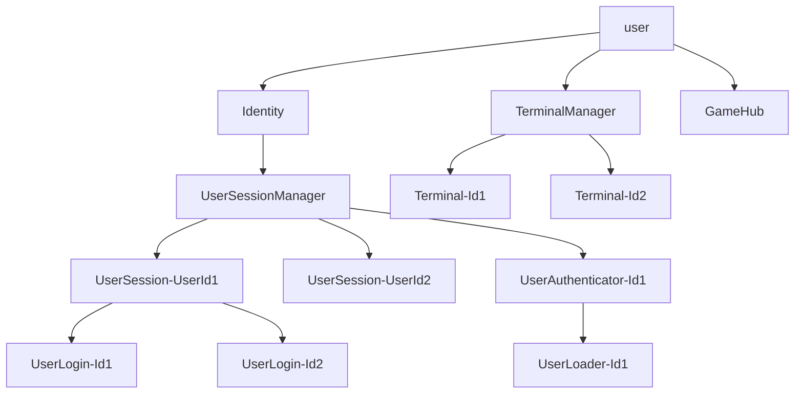

# Actor Model

# Messages

## Identity

- LoginUser => UserSessionManager

## UserSessionManager

- LoginUser
  - AuthUser -> new UserAuthenticator
- UserAuthError
  - UserLoginError -> Sender
- UserAuthSuccess
  - UserLoginSuccess -> UserSession-{userId}

## UserAuthenticator-{id}

- AuthUser
  - LoadUserByUsername -> new UserLoader
- UserLoadError
  - UserAuthError -> Parent
- UserLoadSuccess
  - UserAuthError -> Sender => Stop
  - UserAuthSuccess -> Sender => Stop

## UserLoader-{id}

- LoadUserByUsername
  - UserLoadError -> Sender => Stop
  - UserLoadSuccess -> Sender => Stop

## UserSession-{userId}

- UserLoginSuccess -> new UserLogin
- LogoutUser

## UserLogin-{id}

- UserLoginSuccess
  - UserLogin -> LoginSender
- LogoutUser => Parent

## Terminal-{id}

- Input
  - Output
