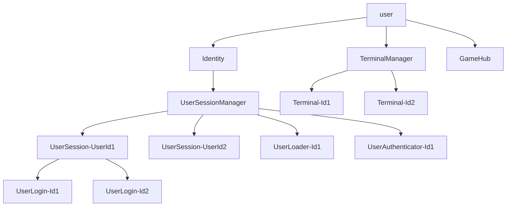

# Actor GameHub

## Actor Model

## Messages

### Identity

- UserLogin => UserSessionManager

### UserSessionManager

- UserLogin
  - LoadUser -> UserLoader
- LoadUserError
  - UserLoginError -> Sender
- LoadUserSuccess
  - AuthUser -> UserAuthenticator
- AuthUserError
  - UserLoginError -> Sender
- AuthUserSuccess
  - UserLoginSuccess -> UserSession-{userId}
- SessionClose

### UserLoader-{id}

- LoadUser
  - LoadUserError -> Sender => Stop
  - LoadUserSuccess -> Sender => Stop

### UserAuthenticator-{id}

- AuthUser
  - AuthUserError -> Sender => Stop
  - AuthUserSuccess -> Sender => Stop

### UserSession-{userId}

- UserLoginSuccess
- UserLogout
  - SessionClose -> Parent

### UserLogin-{id}

- UserLogout => Parent

### Terminal-{id}

- Input
  - Output
